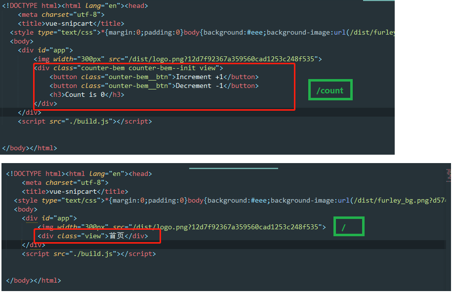

# low逼版vue-ssr
> - 很多小公司做不到完整的SSR，只能曲线来做
> - 将网页在platfrom无头浏览器中运行一分钟后，将html抓取到保存下来，这样就出现静态html（SPA的页面组件都都在js中了，ssr就是把他们抽取出来塞进html中）
> - 使用插件: prerender-spa-plugin

**本质就是:生成相应的html，页面内容基本一样，不同的地方就是把 <router-view class="view"></router-view> 替换成相应v组件，进而形成一个个静态的html**

```
const PrerenderSPAPlugin = require("prerender-spa-plugin");
plugins: [
    new PrerenderSPAPlugin(
      //将渲染的文件放到dist目录下
      path.join(__dirname, "/dist"),
      //需要预渲染的路由信息
      ["/", "/counter"], //生成那些静态页面，路由里面定义的
      {
        //在一定时间后再捕获页面信息，使得页面数据信息加载完成
        renderAfterTime: 50000,
        //忽略打包错误
        ignoreJSErrors: true,
        phantomOptions: "--web-security=false",
        maxAttempts: 10
      }
    )
```

